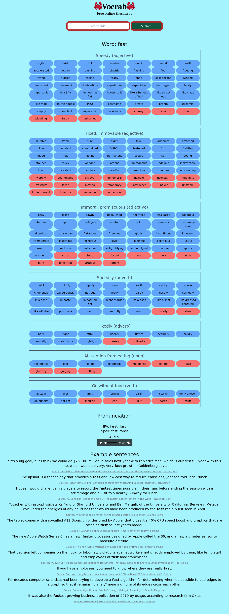

# Vocrab

Vocrab is a Rust server that acts as a frontent for thesaurus.com. There is an instance running at [my personal site](https://vocrab.matthew.science).

Before you hammer my server: consider you can scrape it from the actual site if that's what you're interested in, rather than muddling through HTML. Read the source of the [rust library I wrote](https://github.com/sigaloid/thesaurus-web-lib/).

It is a far more lightweight webpage and in my opinion looks better 😄

This project is meant to be in line with [Libreddit](https://github.com/spikecodes/libreddit) and other frontend proxies. Currently it simply scrapes the API.

## Roadmap

* JSON API (I made a [rust library](https://github.com/sigaloid/thesaurus-web-lib))
* Better looking webpage
* Night mode button

I'll accept any PR's that add these 😄
